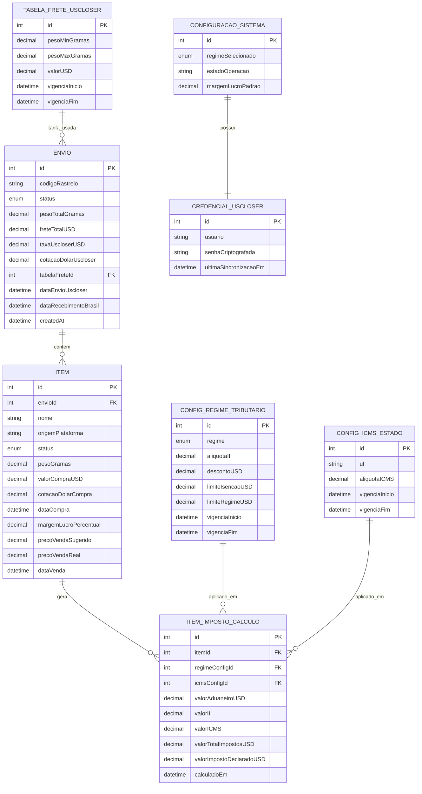

# 📦 importa


Controle de itens comprados no exterior (ex: eBay) para revenda no Brasil — do custo em dólar até o preço de venda sugerido, passando por frete, câmbio e imposto de importação.

## Sobre

Os itens são agrupados por **envio**, consolidado e despachado por uma transportadora terceirizada (USCloser). O sistema acompanha cada item desde a compra até a venda, registrando em cada etapa:

- Valor de compra em USD e a cotação do dólar do dia
- Peso, para ratear frete e taxas do envio proporcionalmente
- Imposto de importação, calculado por um regime tributário parametrizável (troca de regime não exige alterar código)
- Preço de venda sugerido, a partir do custo total + margem de lucro variável por item

## Status

- [x] Estrutura do projeto (Next.js + TypeScript + Tailwind + Prisma/SQLite)
- [x] Modelo de dados inicial ([docs/database.md](docs/database.md))
- [ ] Cadastro de itens e envios
- [ ] Motor de cálculo de imposto (PF/RTS ↔ PJ/DUIMP)
- [ ] Integração com USCloser (scraper de cotação e calculadora de frete)
- [ ] Sugestão de preço de venda

## Modelo de dados

Documentação completa, com a descrição de cada entidade e as decisões de design, em [docs/database.md](docs/database.md).



## Stack

- [Next.js](https://nextjs.org) (App Router) + [TypeScript](https://www.typescriptlang.org)
- [Tailwind CSS](https://tailwindcss.com)
- [Prisma](https://www.prisma.io) + SQLite

## Rodando localmente

```bash
npm install
npx prisma migrate dev
npm run dev
```

Abre em [http://localhost:3000](http://localhost:3000).

## Documentação

- [docs/database.md](docs/database.md) — modelo de dados, diagrama ER e decisões de design
