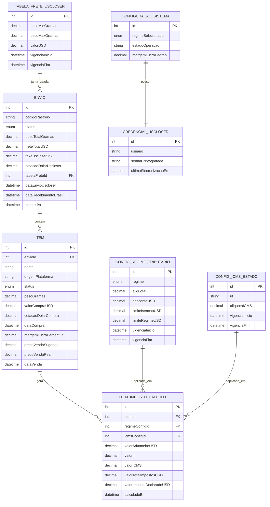

# Modelo de dados — importa

Proposta inicial de esquema (Prisma + SQLite) para discussão, antes de virar código.

## Diagrama

## Entidades

### Envio
Um envio consolidado pela USCloser, contendo um ou mais itens. Guarda o frete total (Packet Standard®, calculado por faixa de peso × peso somado dos itens), a cotação do dólar usada pela USCloser naquele momento, e referência a qual faixa da tabela de frete foi aplicada (auditoria). `pesoTotalGramas` é um **snapshot gravado no momento do cálculo do frete** (não recalculado dinamicamente a partir dos itens) — decisão tomada para preservar o dado histórico exato usado naquele envio, mesmo que os itens sejam editados depois. Serve como registro de compliance.

### Item
Cada unidade comprada. Pode existir sem `envio` (comprado mas ainda não agrupado). Guarda custo de compra em USD e a cotação do dólar **do dia da compra** (separada da cotação da USCloser). Tem status próprio de ciclo de vida (comprado → recebido USCloser → enviado → recebido no Brasil → vendido) e, quando vendido, preço e data reais.

### ItemImpostoCalculo
Snapshot do cálculo de imposto de um item — guarda o resultado (II, ICMS, total) e **qual configuração** (regime + ICMS do estado) foi usada. Histórico separado do item porque os parâmetros mudam com o tempo e um recálculo não deve apagar o cálculo anterior.

`valorImpostoDeclaradoUSD` é um campo **editável manualmente** — o valor de imposto efetivamente **declarado no envio para o Brasil** (que pode divergir do `valorTotalImpostosUSD` calculado internamente). Guardar os dois lado a lado permite comparar calculado vs. declarado, o que serve como rastro de compliance.

### ConfiguracaoRegimeTributario
Tabela parametrizável e versionada por vigência (`vigenciaInicio`/`vigenciaFim`). Guarda alíquota de II, desconto em USD, limites do regime (isenção e teto), por tipo de regime (`PF_RTS` ou `PJ_DUIMP`). Troca de regime é uma configuração, não uma reescrita de código.

### ConfigIcmsEstado
Alíquota de ICMS por estado, também versionada por vigência (varia por estado e muda com a legislação).

### TabelaFreteUsCloser
Tabela de faixas de peso × valor, espelhando a "calculadora de frete" (Packet Standard®) do site da USCloser. Também versionada, pois a USCloser pode reajustar valores.

### CredencialUscloser
Login/senha (senha sempre criptografada) usados pelo scraper para autenticar na área logada da USCloser.

### ConfiguracaoSistema
Configuração única do sistema: regime tributário ativo, estado (UF) de operação (para lookup do ICMS), margem de lucro padrão sugerida para novos itens.

## Decisões

- **Peso do envio**: gravado como snapshot em `Envio.pesoTotalGramas` no momento do cálculo do frete (não recalculado dinamicamente). Motivo: compliance — preserva o dado exato usado naquele envio.
- **Preço de venda sugerido**: persistido em `Item.precoVendaSugerido`, recalculado quando a margem (`margemLucroPercentual`) muda.
- **Valor de imposto declarado**: novo campo `ItemImpostoCalculo.valorImpostoDeclaradoUSD`, editável manualmente, guardado ao lado do valor calculado — permite comparar calculado vs. declarado para compliance.
- **Autenticação de usuário do sistema**: confirmado que não haverá login próprio do "importa" — uso pessoal local. Só existe credencial armazenada para a USCloser (terceiro, criptografada).
